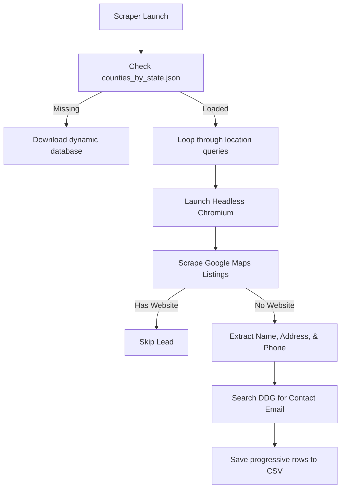

**TL;DR:** The official Google Places and Maps APIs are incredibly expensive, billing you per request and quickly burning through your budget. By leveraging headless Playwright Chromium and Python, you can scrape thousands of local business leads dynamically and quota-free. Even better, you can target businesses that **completely lack website links**—the absolute warmest prospects for free portfolio-builder website offers.

In this post, I break down the exact architecture of my new open-source Lead Scraper, walk through the dynamic 50-state county self-healing database, and show you how to start harvesting verified prospects immediately.

---

## Watch the Quick Walkthrough!

Check out my newest YouTube Short breaking down the insane results from this scraper campaign:

<div class="video-container" style="max-width: 360px; margin: 0 auto;">
  <iframe src="https://www.youtube.com/embed/o4YKj2Rebpo" style="width: 100%; aspect-ratio: 9/16; border-radius: 12px; border: 1px solid #222;" allowfullscreen></iframe>
</div>

---

## Table of Contents
- [The Goldmine of Website-Less Leads](#the-goldmine-of-website-less-leads)
- [How It Works: Zero-API Scraper Architecture](#how-it-works-zero-api-scraper-architecture)
- [Universal 50-State Targeting Engine](#universal-50-state-targeting-engine)
- [DuckDuckGo Email Harvesting](#duckduckgo-email-harvesting)
- [How to Run It Locally](#how-to-run-it-locally)
- [Conclusion and Next Steps](#conclusion-and-next-steps)

---

## The Goldmine of Website-Less Leads

If you are a freelance developer, agency owner, or software engineer building a client portfolio, you already know that **cold outreach is a numbers game**. But emailing or texting generic lists yields low response rates.

The secret is **hyper-specific targeting**. 

By filtering Google Maps results to only capture local businesses (like plumbers, roofers, landscaping services, and beauty salons) that **do not have a website link listed**, you find businesses that:
1. Are actively operating and serving local customers.
2. Are losing up to 50% of mobile search traffic to competitors due to a lack of online presence.
3. Are highly receptive to a professional, high-speed website mockup or portfolio-builder testimonial offer.

---

## How It Works: Zero-API Scraper Architecture

Our system is written in Python and operates through a highly efficient browser automation pipeline:



By utilizing Playwright, the scraper bypasses the strict rate-limiting and billing associated with the official Google Maps SDKs. It automatically navigates, handles dynamic scrolling, accepts standard consent forms, and extracts coordinates, phone numbers, and addresses.

---

## Universal 50-State Targeting Engine

One of the biggest limitations of generic web scrapers is the manual input of regions. To solve this, I built a **self-healing, localized database** directly into the core engine.

If the script detects that `counties_by_state.json` is missing, it dynamically downloads the full U.S. Census Bureau county boundaries database (under 700KB) in less than a second. 

This enables you to pass a simple state parameter—supporting abbreviations or full names—to target all counties in a state instantly:

```bash
# Target all 254 counties in Texas
python scraper.py --industry "roofing" --state TX

# Target all 62 counties in New York State
python scraper.py --industry "construction" --state "New York"
```

---

## DuckDuckGo Email Harvesting

For every website-less business harvested, the script performs a secondary dynamic search on DuckDuckGo contact indexes to extract the public business email address. 

By applying robust email matching regexes and filtering out asset domains (such as static icons or DDG site links), the scraper yields highly direct contact details:

```python
# The email locating pipeline
clean_name = re.sub(r'[^\w\s]', '', name)
query = f'"{clean_name}" {search_query} contact email'
# Queries DuckDuckGo dynamically for real-time contact references
```

---

## How to Run It Locally

We have fully open-sourced the scraper, packaged it with a comprehensive step-by-step installation guide, and included an advanced `AGENT.md` integration playbook for automated AI agents to execute.

1. **Activate Environment & Install Playwright**:
   ```bash
   python3 -m venv venv
   source venv/bin/activate
   pip install -r requirements.txt
   playwright install chromium
   ```
2. **Execute Scrape**:
   ```bash
   python scraper.py --industry "landscaping" --state NJ
   ```

---

## Clone and Contribute!

The entire codebase is live and fully open-sourced on GitHub. You can clone the engine, configure optional carrier validation features to filter out landlines, and start scaling your local client outreach today:

👉 **[https://github.com/Robj1925/google-maps-scraper](https://github.com/Robj1925/google-maps-scraper)**
