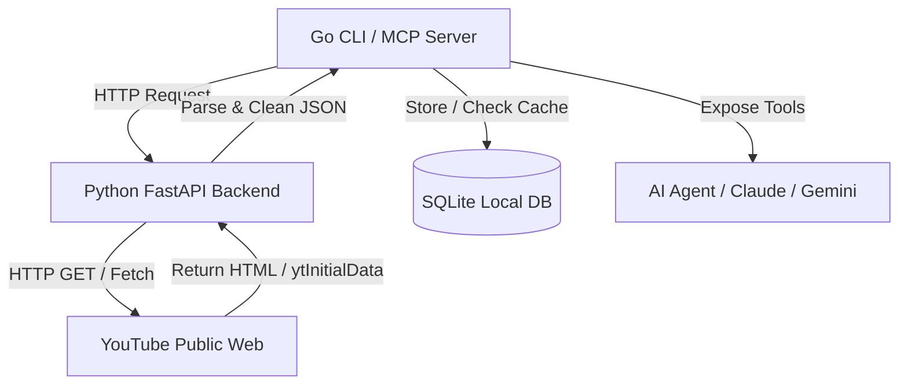

**TL;DR:** The official YouTube API has a strict 10,000-unit daily quota, which is easily exhausted when analyzing multiple channels. By building a high-performance, zero-API YouTube scraping engine in Python, combining it with a compiled Go CLI and a local SQLite cache, you can pull real-time channel statistics and video metrics on demand—completely quota-free. Even better, you can wrap it in an MCP (Model Context Protocol) server to let your AI agents run deep channel analysis autonomously.

---

## Table of Contents
- [The YouTube API Quota Problem](#the-youtube-api-quota-problem)
- [The Solution: Quota-Free, On-Demand Web Scraping](#the-solution-quota-free-on-demand-web-scraping)
- [System Architecture Overview](#system-architecture-overview)
- [How Does the Scraper Engine Work?](#how-does-the-scraper-engine-work)
- [Fast SQLite Caching in Go](#fast-sqlite-caching-in-go)
- [Connecting the Tool to AI Agents via MCP](#connecting-the-tool-to-ai-agents-via-mcp)
- [Frequently Asked Questions (FAQ)](#frequently-asked-questions-faq)
- [Conclusion and Next Steps](#conclusion-and-next-steps)

---

## The YouTube API Quota Problem

If you have ever built tools utilizing the YouTube Data API v3, you have likely run into the notorious daily quota limit. YouTube gives developers a default allocation of **10,000 quota units per day**. 

At first glance, that sounds like a lot. However, when you dig into the cost structure, the limits become incredibly restrictive:
* **Search operations (`search.list`)**: Consumes **100 units per request**.
* **Video list details (`videos.list`)**: Consumes **1 unit per request**.
* **Channel queries (`channels.list`)**: Consumes **1 unit per request**.

If you want to perform serious analytics—such as monitoring competitor uploads, tracking keyword performance, or letting an AI agent review video metrics multiple times a day—you will run out of quota in just a few dozen searches. Requesting a quota increase is a tedious, months-long process that requires enterprise justification and verification. 

---

## The Solution: Quota-Free, On-Demand Web Scraping

To solve this, I designed and built an open-source, quota-free YouTube scraping engine. Instead of querying the formal API endpoints, the system retrieves the public YouTube channel pages directly and parses the embedded JSON application state.

When you visit a YouTube channel or search results page in a browser, YouTube delivers a pre-loaded JavaScript object containing all initial UI rendering data. This is stored in a global variable called `ytInitialData`. 

By making a simple GET request with browser-like headers, extracting this script block, and recursively evaluating its JSON structure, we can extract:
1. **Video metadata**: Video ID, title, length, and description.
2. **Engagement stats**: Views, relative publication date (e.g., "3 days ago"), and thumbnail URLs.
3. **Channel info**: Subscriber counts, avatar images, and verified badges.

All of this happens programmatically, in milliseconds, with **zero API keys** and **no quota limitations**.

---

## System Architecture Overview

The system is structured as a premium monorepo containing a high-performance Python parser backend and a lightning-fast Go client CLI. 



### Why Go and Python Together?
* **Python** is the industry standard for raw HTML manipulation and dynamic JSON path traversal. Using **FastAPI**, we expose a modular, lightweight microservice that accepts queries and returns clean, structured schema objects.
* **Go** is the king of CLI engineering and concurrency. The Go client (`printing-press`) handles user commands, manages local database persistence, executes fast queries, and operates as a Model Context Protocol (MCP) server.

---

## How Does the Scraper Engine Work?

At the core of the Python microservice is a recursive JSON traversal engine. Since YouTube changes its UI layout frequently, hardcoded selectors are fragile. Instead, we scan the `ytInitialData` object recursively, looking for standard component renderers.

Here is a simplified look at the Python parsing logic that extracts video cards from the channel page markup:

```python
import re
import json
import httpx

def extract_yt_initial_data(html_content: str) -> dict:
    # Use regex to find the script containing ytInitialData
    pattern = r"var ytInitialData\s*=\s*(\{.*?\});"
    match = re.search(pattern, html_content)
    if not match:
        raise ValueError("Could not find ytInitialData in page HTML")
    return json.loads(match.group(1))

def recursive_find_key(data: any, target_key: str) -> list:
    # Recursively traverse JSON to find specific keys like 'videoRenderer'
    results = []
    if isinstance(data, dict):
        for k, v in data.items():
            if k == target_key:
                results.append(v)
            else:
                results.extend(recursive_find_key(v, target_key))
    elif isinstance(data, list):
        for item in data:
            results.extend(recursive_find_key(item, target_key))
    return results
```

Exposing this via FastAPI lets us run a single, unified endpoint that compiles a list of rich video structures on the fly:

```json
[
  {
    "id": "7I0COaYlEbk",
    "title": "How to Automate Your Entire Skool Community With One Tool",
    "views": 4325,
    "published_time": "3 days ago",
    "duration": "14:22",
    "thumbnail": "https://i.ytimg.com/vi/7I0COaYlEbk/hqdefault.jpg"
  }
]
```

---

## Fast SQLite Caching in Go

To avoid hitting YouTube's servers excessively and to ensure near-zero latency, the Go CLI client implements **SQLite persistent caching**.

Every time a user (or an AI agent) runs a query, the CLI does a quick evaluation:
1. **Cache Hit**: Checks if the target channel's data was updated recently (e.g., within the last 60 minutes). If yes, it loads the records instantly from local SQLite.
2. **Cache Miss**: If the data is stale or missing, the CLI fires an asynchronous query to the Python FastAPI backend, updates the local SQLite database, and returns the fresh metrics.

This dual-layer architecture guarantees that heavy usage will never trigger IP blocks or throttles from YouTube, while ensuring that the developer always has lightning-fast access to channel history.

Here is the database schema used for indexing the video metrics in Go:

```sql
CREATE TABLE IF NOT EXISTS videos (
    id TEXT PRIMARY KEY,
    channel_id TEXT,
    title TEXT,
    views INTEGER,
    published_time TEXT,
    duration TEXT,
    thumbnail_url TEXT,
    fetched_at TIMESTAMP DEFAULT CURRENT_TIMESTAMP
);
```

---

## Connecting the Tool to AI Agents via MCP

One of the most powerful features of this tool is its native integration with **Model Context Protocol (MCP)**. MCP allows AI agents (like Claude Desktop, Gemini CLI, or custom local scripts) to securely execute local commands.

By setting up the Go CLI to listen as an MCP server, you can give your AI agents commands such as:
> *"Audit my channel's recent uploads, find the videos with the lowest views, and suggest three improvements based on the best-performing titles."*

The AI agent will:
1. Spin up the Go MCP server.
2. Run the internal commands to pull the SQLite database or scrape fresh data.
3. Formulate a structured analysis showing view-to-subscriber ratios, content trends, and dynamic title optimizations.

This completely bypasses the need to build expensive web interfaces—your terminal and your LLM agent *become* the interface.

---

## Frequently Asked Questions (FAQ)

**What is the YouTube Zero-API Scraper?**
It is a dual-language (Python + Go) open-source tool that retrieves YouTube video metadata, search listings, and channel analytics on-demand, without using the official YouTube Data API.

**Do I need a Google Cloud API Key to use this?**
No! Because it operates via public page scraping and recursive `ytInitialData` evaluation, it requires zero API keys, zero Google Cloud projects, and has no daily quota limits.

**Is it safe to scrape YouTube?**
Yes. The tool makes standard HTTP GET requests using typical browser headers, mimicking a user browsing a public page. However, to respect YouTube's terms and prevent IP throttling, the Go client employs a built-in SQLite cache to limit unnecessary network requests.

**Can my AI agent use this?**
Yes! The Go CLI functions as an MCP (Model Context Protocol) server. You can add it to your Claude or Gemini configuration files to let your agent query YouTube metrics autonomously.

**How do I install the tool?**
You can clone the public repository at `https://github.com/Robj1925/youtube-zero-api-scraper` and follow the comprehensive README setup instructions for compiling the Go executable and running the FastAPI parser service.

---

## Conclusion and Next Steps

By taking control of your data collection pipeline and bypassing quota constraints, you unlock the ability to run unrestricted channel audits, competitors analytics, and autonomous AI-driven publishing workflows.

* **Ditch the quotas**: Deploy the Zero-API microservice.
* **Cache locally**: Keep lookup speeds instant with SQLite.
* **Integrate AI**: Hook up the MCP server to automate your content strategies.

Ready to dive deeper into custom AI engineering and autonomous workflows? Join the [AI Academy](https://www.skool.com/ai-academy-with-robby-6849/about) to collaborate with other builders and master advanced systems!

---
**About the Author:**
Robby J is a software engineer, AI systems architect, and creator of the [Code With Robby](https://www.youtube.com/@Code-With-Robby) YouTube channel. Holding an M.S. in Computer Science, he builds and writes about next-generation AI agents, autonomous developer workflows, and custom MCP integrations. Follow him on [GitHub](https://github.com/Robj1925) or watch his tutorials live on [YouTube](https://www.youtube.com/@Code-With-Robby).
